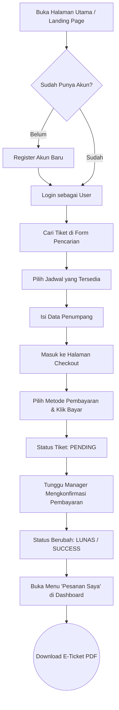
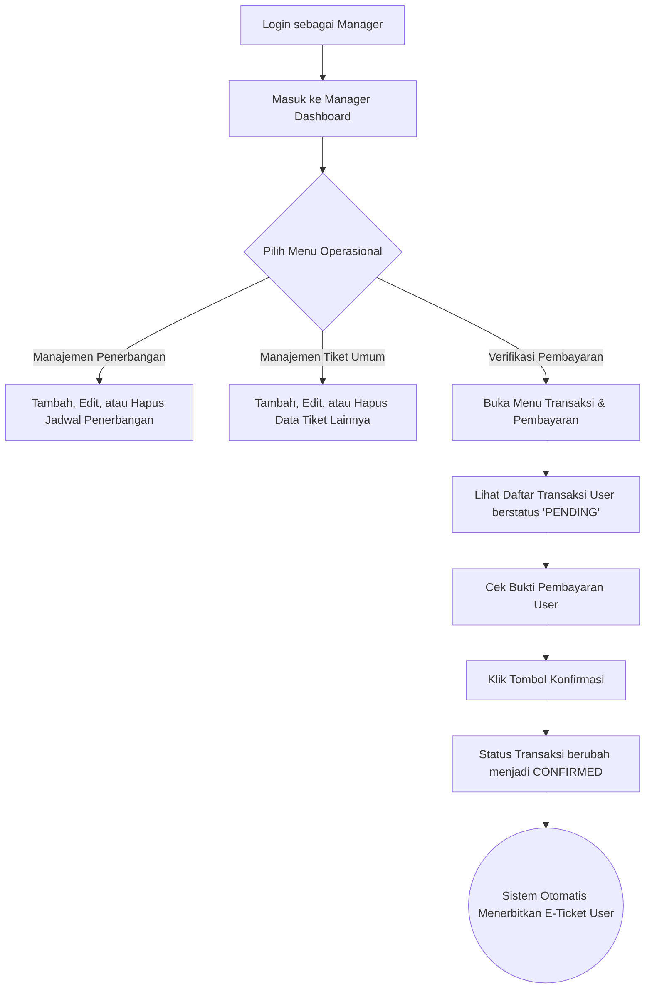
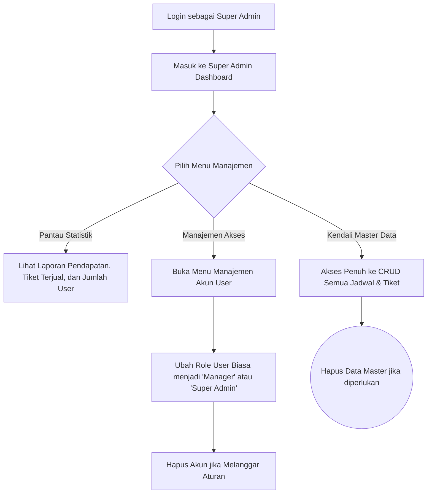

# Alur Kerja (Workflow) Sistem TixGo E-Ticketing

Berikut adalah panduan alur kerja untuk masing-masing role (User Biasa, Manager, dan Super Admin) dalam sistem TixGo. Alur ini menggambarkan bagaimana setiap pengguna berinteraksi dengan sistem mulai dari awal hingga akhir.

---

## 1. Alur Kerja: User Biasa (Pelanggan)

User biasa adalah pelanggan yang ingin memesan tiket. Alur utamanya berpusat pada pencarian, pemesanan, pembayaran, dan mendapatkan E-Ticket.

---

## 2. Alur Kerja: Manager (Admin Operasional)

Manager bertanggung jawab penuh atas operasional sehari-hari. Mulai dari menambah data jadwal transportasi hingga memverifikasi pembayaran dari pelanggan.

---

## 3. Alur Kerja: Super Admin (Owner / Sistem Admin)

Super Admin memiliki akses mutlak ke seluruh sistem. Selain bisa melakukan semua tugas Manager, Super Admin juga berhak mengelola hak akses akun pengguna dan melihat laporan pendapatan keseluruhan.

---

### Ringkasan Relasi Kerja Sama Ketiga Role:
1. **Manager** membuat jadwal tiket.
2. **User Biasa** memesan tiket tersebut dan membayar.
3. **Manager** memverifikasi uang yang masuk dan menerbitkan tiket.
4. **Super Admin** mengawasi seluruh proses (melihat total pendapatan, mendaftarkan Manager baru, atau menghapus pengguna nakal).
